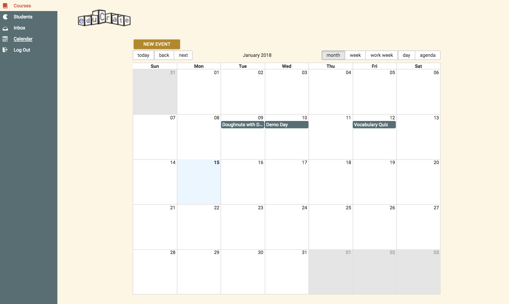

# eduCrate


## Overview:
__eduCrate__, a learning management system, offers a streamlined infrastructure advantageous for the blended learning environments of grade-school aged students. The software provides educators an authoring tool in which to deliver assignments, document the progress of students, record correspondence with parents, and otherwise manage and administer all other miscellaneous instructional content directly to the parents and students.


## Github Link:
[eduCrate GitHub](https://github.com/eddieatkinson/schoolApp)

## Team Members & Roles:
* [Eddie Atkinson](https://github.com/eddieatkinson)
**Charming Genius|console.logger|Tolerates Giraffes|can now officially say he's a React Developer**
* [Valerie Jane Thoma](https://github.com/ValerieThoma)
**Charming ~~Genius~~|Likes Giraffes|Lives for Hugs|can now officially say she's a React Developer**

## Features:
**Registration and Log In**
* Software accepts log in from three distinct registered users: *teachers*, *parents*, and *students*
* Teachers and Parents log in using their email, a hashed password, and a generated token 
* Students log in using a username, hashed password, and a generated token

****

**Features for Teachers**
* *This application was designed for ease of use among teachers and parents, particularly teachers*

  *Teachers have administrative control over the information that is uploaded and disseminated*

  *The teacher's Dashboard and Navigation Bar will have more features than both parents and students*
* Dashboard Nav routes users to __Courses__, __Students__, __Inbox__, __Calendar__, and __Log out__
* __Courses__ view displays a list of that user's courses and course descriptions
* Clickable __Course__ Name generates a __Course__ Navigation Bar
* __Course__ Navigation Bar routes users to __Syllabus__, __Assignments__, __Grades__, and __Students
* __Syllabus__ view displays the syllabus for the course previously selected
* __Assignments__ view displays name and description of current assignments for the selected course
* For the teacher, he/she has button to 'add assignments'
* __Add Assignment__ view allows the teacher to name and describe the new assignment - it is then added to the __Assignment__ view
* __Students__ view displays the names of the teacher's students along with email, phone, and a link to guardian info
* Guardian info link displays guardian's information (name, email, telephone)  
* When the name of the guardian is clicked, a compose message box is generated 
* __Grades__ view displays student name, assignment name, assignment status, and grade
* Because the teacher will have a  multitude of grades data, the __Grades__ table is searchable
* The teacher also has an 'edit' option to update a student's assignment status or grade
* The __Inbox__ displays unread messages, both numerically near the Dashboard Navbar icon and in bold text in the message view. User can compose and send messages, view all previous sent messaes.
* The __Calendar__ displays and paginates through months, weeks, work weeks (M-F), days, and agenda tables
* The teacher's calendar features, exclusively, an 'add event' button
* The __Add Event__ display allows teachers to name the event, chose a start and end time from a date picker, enter notes about or a description of the event, and assign the event to a specific course
* __Log Out__ destroys the users token

****

**Features for everyone**
* Dashboard Nav routes users to __Courses__, __Inbox__, __Calendar__, and __Log out__
* __Courses__ view displays a list of that user's courses and course descriptions
* Clickable __Course__ Name generates a __Course__ Navigation Bar
* __Course__ Navigation Bar routes users to __Syllabus__, __Assignments__, __Grades__
* __Syllabus__ view displays the syllabus for the course previously selected
* __Assignments__ view displays name and description of current assignments for the selected course
* __Grades__ view displays student name, assignment name, assignment status, and grade
* To best serve the many instances of parents with multiple students, the __Grades__ table is searchable
* The __Inbox__ displays unread messages, both numerically near the Dashboard Navbar icon and in bold text in the message view. User can compose and send messages, view all previous sent messaes.
* The __Calendar__ displays and paginates through months, weeks, work weeks (M-F), days, and agenda tables
* __Log Out__ destroys the users token     


<!-- ## Challenges and Solutions: -->

## Architecture: 
* Frontend: React, Redux, JSX, Sass, React-Materialize, Material-UI
* Backend API: Node.js, Express, MySQL
* Server: AWS EC2

## Live Demo:
[Watch on Youtube](https://youtu.be/38bW-8KEB_A)


## Screenshots:
Log in page:

Assignment view from Dashboard: 

Calendar: 

Compose Message:


## URL:
[eduCrate](http://schoolapp.eddiebatkinson.com)

## Code snippets:
Dashboard Navbar inbox icon indicates how many unread messages a user has. This number decrements when read. 
``` javascript
import axios from 'axios';

export default function(level, userId){
	const url = `${window.apiHost}/${level}s/countNewMessages/${userId}/get`; // uses "teachers" Express route but works for everyone
	const axiosPromise = axios.get(url)
	return{
		type: "GET_MESSAGE_COUNT",
		payload: axiosPromise
	}
}

router.get('/countNewMessages/:teacherId/get', (req, res)=>{
	const teacherId = req.params.teacherId;
	var coursesQuery = `SELECT COUNT(messageStatus)
		FROM inbox
		WHERE messageStatus = "new" and receiverId = ? AND receiverStatus = 1;`;
	connection.query(coursesQuery, [teacherId], (error, results)=>{
		if(error){
			throw error;
		}else{
			res.json(results);
		}
	});
});


```
Show history of sent messages
``` javascript
router.get('/sentMessages/:userId/get', (req, res)=>{
	const userId = req.params.userId;
	var sentMessageQuery = `SELECT inbox.id, inbox.subject, inbox.body, inbox.receiverStatus,
		inbox.senderStatus, inbox.receiverName, inbox.receiverId, inbox.senderId, inbox.senderName, inbox.messageStatus,
		DATE_FORMAT(inbox.date, '%M %D\, %Y') as date, status.level AS receiverLevel,
		s2.level AS senderLevel
		FROM inbox
		INNER JOIN status ON inbox.receiverStatus = status.statusId
		INNER JOIN status s2 ON inbox.senderStatus = s2.statusId
		WHERE inbox.senderId = ? AND inbox.senderStatus = 1
		ORDER BY inbox.date DESC;`;
	connection.query(sentMessageQuery, [userId], (error, results)=>{
		if(error){
			throw error;
		}else{
			res.json(results);
		}
	});
});

	componentDidMount(){
		if(this.props.match.params.status === "sent"){
			this.setState({
				show: true
			})
		}
		var level = this.props.auth.level;
		var status = `${this.props.auth.level}s`;
		console.log(status);
		console.log(this.props.auth);
		var sent;
		console.log(this.props.match);
		if(this.props.match.path === '/sentMessages'){
			sent = true;
		}else{
			sent = false;
		}
		var whichId = `${level}Id`;
		var userId;
		switch(whichId){
			case "teacherId":
				userId = this.props.auth.teacherId;
				break;
			case "parentId":
				userId = this.props.auth.parentId;
				break;
			case "studentId":
				userId = this.props.auth.studentId;
				break;
			default:
				break;	
		}
		this.props.getInbox(status, userId, sent);
		sent = false;
	}


```
Teachers can edit grades, change status of assignment, search grades, etc.
``` javascript
class Grades extends Component{
	constructor(){
		super();
		this.state = {
			grades: []
		}
		this.changeStatus = this.changeStatus.bind(this);
		this.changeGrade = this.changeGrade.bind(this);
		this.editInformation = this.editInformation.bind(this);
		this.handleSearch = this.handleSearch.bind(this);
	}

changeGrade(event, aid, sid, index){
		console.log("Change grade");
		var newGrade = event.target.previousSibling.childNodes[0].value;
		console.log(newGrade);
		var newData = {
			newGrade: newGrade,
			aid: aid,
			sid: sid
		}
		console.log(newData);
		var axiosPromise = axios({
			url: `${window.apiHost}/teachers/changeGrade`,
			method: 'POST',
			data: newData
		}).then((response)=>{
			console.log(response.data);
			if(response.data.msg === 'gradeUpdated'){
				// make a copy of the grades state var so we can change the student
				// var newGrades = {...this.state.grades};
				var courseId = this.props.match.params.courseId;
				var teacherId = this.props.auth.teacherId;
				const url = `${window.apiHost}/teachers/grades/${courseId}/${teacherId}/get`;
				axios.get(url)
					.then((response)=>{
						var gradeDataFull = response.data;
						var gradeData = gradeDataFull.map((grade, index)=>{
							return(
								<tr key={index}>
									<td>{`${grade.firstName} ${grade.lastName}`}</td>
									<td>{grade.assName}</td>
									<td>{grade.status}</td>
									<td>
										<Input id='newStatus' />
										<Button className='edit' onClick={(event)=>{
											this.changeStatus(event,grade.aid,grade.sid, index)
										}}>
											Change 
										</Button>
									</td>
									<td>{grade.grade}</td>
									<td><Input id='newGrade' /><Button className='edit' onClick={(event)=>{
											this.changeGrade(event,grade.aid,grade.sid, index)
										}}>
											Change
										</Button></td>
								</tr>
							);
						});
					this.setState({
						grades: gradeData
					});
				})
			}
		})
	}
}	


```

## Acknowledgments:
* Special thank you Robert Bunch, our Ambassador of Quan. 

## Project History: 
12/19/2017 - Project Start
01/10/2018 - DigitaCrafts September '17 cohort Demo Day

